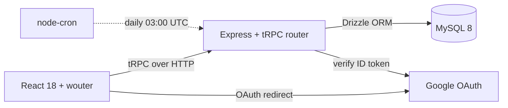
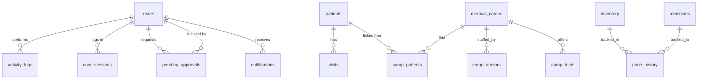
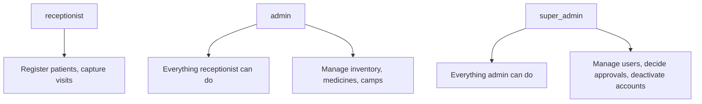
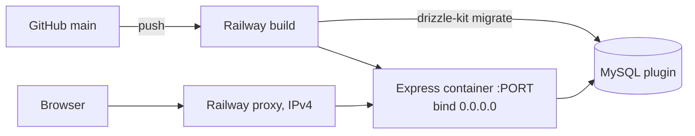
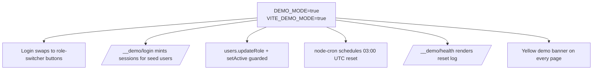

# Architecture — Outreach Health CRM

## Stack

Frontend: React + TypeScript + Tailwind + shadcn/ui, routed by wouter,
state via React Query through tRPC. Backend: Express with tRPC,
Drizzle ORM against MySQL, Google OAuth on top of session cookies
signed with `JWT_SECRET`. Deployment: Railway, single container, MySQL
as a Railway plugin. Demo mode runs a `node-cron` reset job inside the
same process — no separate worker.

## Data model (key tables)

Notes:

- **`camp_patients.patientId` is nullable by design.** Camp records are
  captured field-side and may not match a registered patient at write
  time; the backfill `findCandidate` route resolves them later. See
  the [option C case study](./CASE_STUDY.md#camp-link).
- **`pending_approvals.payload` is JSON-stringified.** Validation runs
  at request time (per-entity schemas) so a stale payload can't smuggle
  invalid fields in.
- **`price_history.newPrice` is `NOT NULL`.** We skip writing a row when
  an admin clears a price (the change isn't tracked) rather than relax
  the constraint — a `null` "new price" doesn't represent a meaningful
  pricing event.
- **`demo_reset_log`** is append-only audit for the nightly reset cron.
  Only written when `DEMO_MODE=true`; stays empty on production.

## Permission model

Three roles plus an unprovisioned default for first-login:

**The approval gate.** When `APPROVALS_ENFORCED=true`, any admin
destructive or major-update action (delete, price change, qty change
exceeding threshold) returns `BAD_REQUEST` with "Submit via
approvals.request." The admin's UI submits the request, the
super-admin sees it on `/pending-approvals`, decides, and the
underlying mutation runs inside the decide transaction. Activity is
logged against the **requesting** admin (not the deciding super-admin)
so the audit trail matches who initiated the change.

**Owner protection.** The foundation owner's account (matched by
`OWNER_OPEN_ID` env var) cannot be deactivated or role-changed via the
API. Direct DB intervention is the only path. This prevents a hostile
super-admin from locking out the actual owner.

**Demo mode gates** (when `DEMO_MODE=true`):

- `users.updateRole` returns `FORBIDDEN` unconditionally.
- `users.setActive` returns `FORBIDDEN` if the target is one of the
  three seeded demo accounts (`demo-super-admin`, `demo-admin`,
  `demo-receptionist`).
- Single-row deletes on patient / inventory / medicine / camp are
  allowed — the daily reset cleans them up anyway.

## Deployment topology

Container start command: `drizzle-kit migrate && node dist/index.js`.
Migrations run before app boot — see the
[silent-failure case study](./CASE_STUDY.md#auto-migrate) for why this
line is non-negotiable. App binds explicitly to `0.0.0.0` so the
Railway proxy (IPv4-only) can reach it — see the
[IPv6 case study](./CASE_STUDY.md#ipv6-bind).

## Demo-mode topology

Demo deploys are a separate Railway project with their own MySQL
plugin and OAuth credentials — never pointed at the foundation's
database. The same container code runs; behavior shifts via env vars:

The role-switcher session-mint and the manual reset endpoint
(`POST /__demo/reset` with `X-Demo-Reset-Secret` header) both set
`X-Robots-Tag: noindex, nofollow` so the demo URLs don't end up in
search results.
